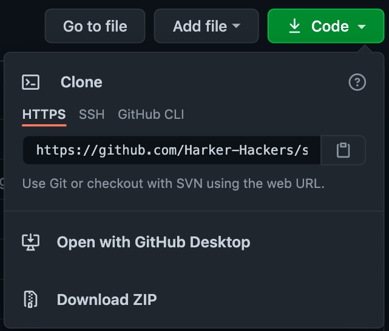

# Schoology Schedule Chrome Extension

Integrate your infinite campus schedule into Schoology. Convinience is key. Navigating between both sites is a pain. Why not have all your school resources on a single page?

You can now view your infnite campus schedule on Schoology!

## Installation

Download this repository as a ZIP file.

After unzipping it, head to [chrome:extensions](chrome://extensions) and turn on developer mode from the top-right of the page.

From the top-left, click <kbd>Load unpacked</kbd>.

Now select the unzipped folder. \
You should have the chrome extension installed now! You can pin it for easy-access to instructions.

## Usage
Click the extension icon. Instructions will pop up. They will probably take thirty seconds to complete.