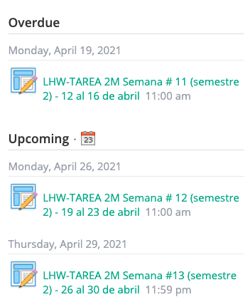
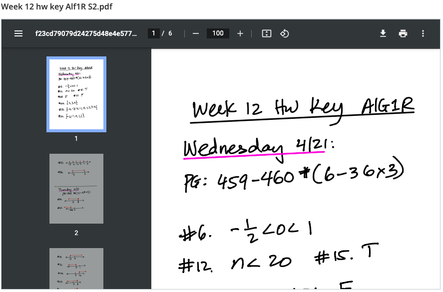
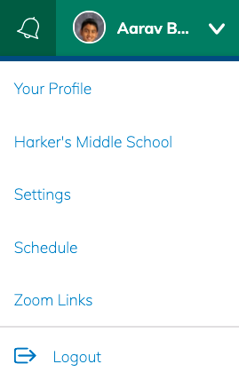

<h1 align="center">Harker Schoology Chrome Extension</h1>

    A chome extension that adds awesome features to Schoology, made specifically for Harker students. 
    By Aarav Borthakur and Aarush Vailaya

## Features

-   ### Infinite campus schedule can now be found on Schoology.

    

-   ### Teachers' zoom links can now be found on Schoology (constantly updating).

    

-   ### "Overdue" section added to classes' pages.

    

-   ### Weekly lunches can be found on Schoology.

    

-   ### Enhanced Schoology PDF viewer.

    

-   ### Much more!

## Installation

Click [here](https://schoology-extension.herokuapp.com) to dowload the extension files (can take up to ten seconds to wakeup app). Unzip the download.

Go to [chrome:extensions](chrome:extensions) and enable developer mode from to top right of your screen, to the right of the search bar.

Drag the unzipped folder to the page, and that's it! You have the extension installed!

## Usage

-   **Zoom links and schedule**: To view your schedule and zoom links, hit your profile picture on the top right of any Schoology page. Hit "schedule" or "zoom links" in the dropdown menu.

-   **Overdue assignments**: To see overdue assignments, enter a course's page and look to the right of your screen. The overdue assignments should appear above the "upcoming".

-   **Lunch**: Too see lunch, look to the top of any Schoology page, next to the search button. Hit the lunch button, and you will be directed to the week's lunch.

## Bugs and Feature Requests

Please email [good.aarav@gmail.com](mailto:good.aarav@gmail.com) for bug reports and feature requests.

## Releases

You can view and install previous releases [here](https://github.com/Harker-Hackers/schoology-extension/releases).

## Contributing

This utility is completely open source! The source code can be found [here](https://github.com/Harker-Hackers/schoology-extension). Feel free to [contribute](https://gist.github.com/MarcDiethelm/7303312)!
